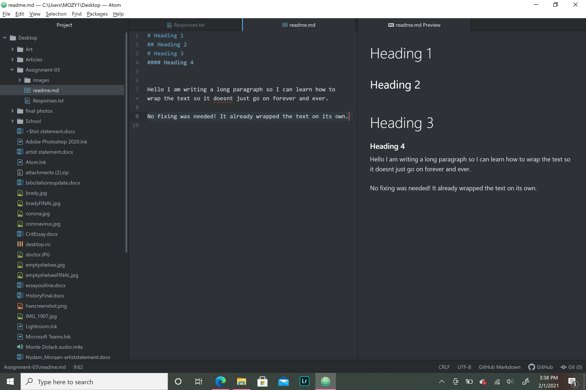

# Assignment 3
## Morgan Nydam
# Heading 3
#### Heading 4

Hello I am writing a long paragraph so I can learn how to wrap the text so it doesnt just go on forever and ever.

No fixing was needed! It already wrapped the text on its own.

[Art Instagram](https://www.instagram.com/morgans.artplace/)

[My Responses](./Responses.txt)

