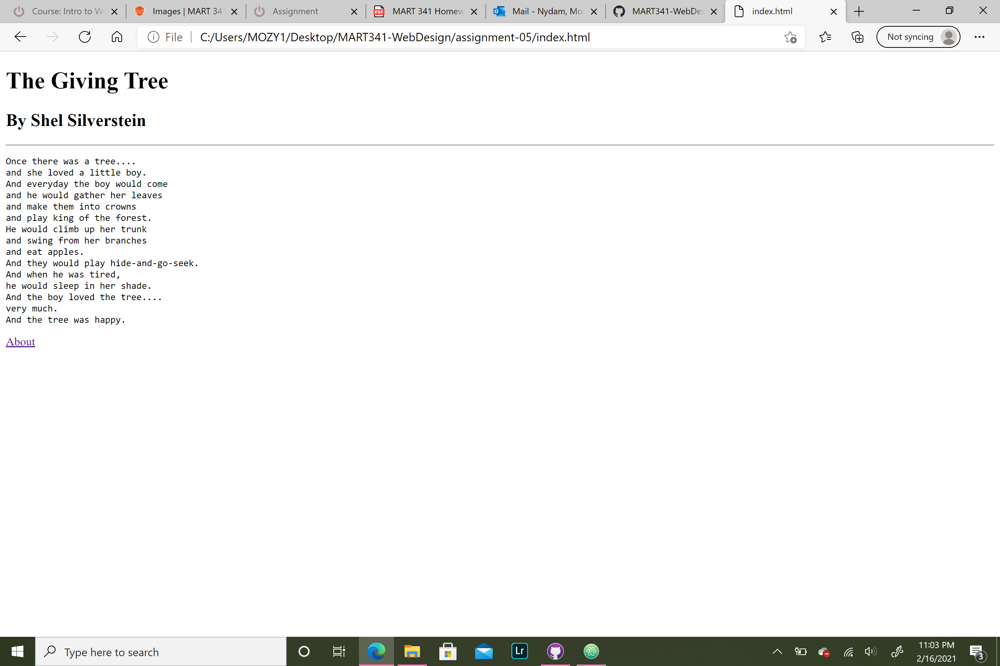

I went to youtube.com. It was much more simple looking and the homepage doesn't show videos right away like it does now. It also seems to be acting like a dating platform which it does not do now.
I learned how to do line breaks, horizontal rules, and to use Github Desktop which was easy. On the other hand though, I am struggling with getting my links and images to work.  

